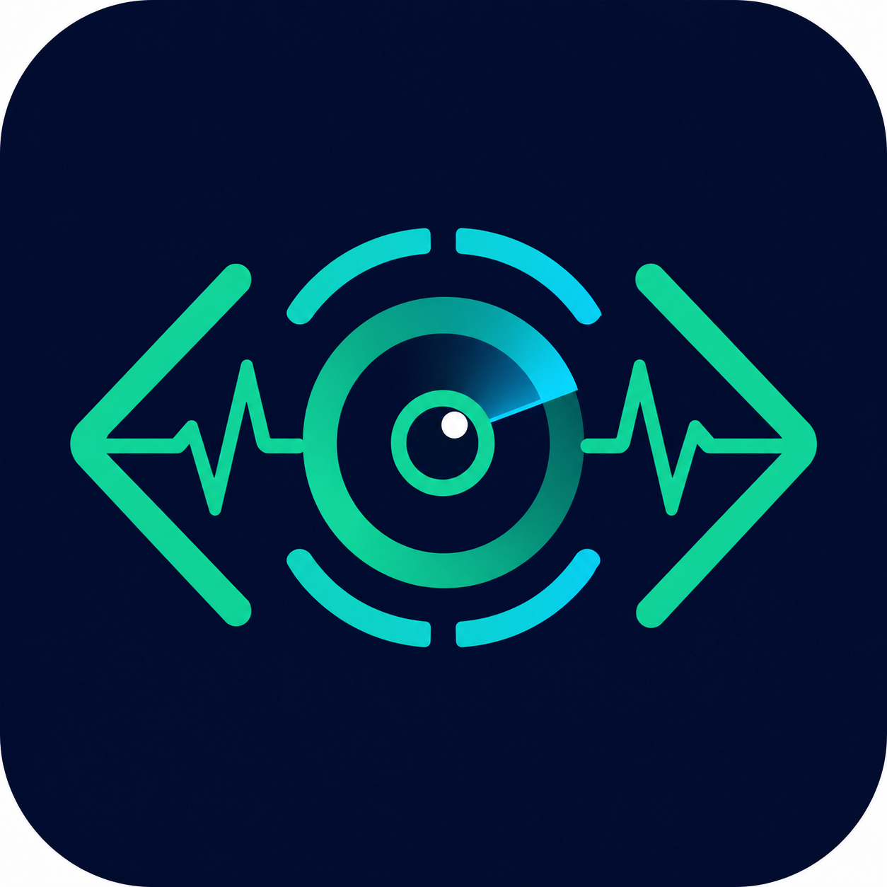

# Codex Traffic Monitor



A privacy-preserving macOS menu bar monitor for local Codex activity.

Codex Traffic Monitor shows:

- Codex processes, CPU, memory, and child processes
- Active TCP endpoint metadata and per-process byte counters
- Locally observed input, cached-input, output, reasoning, and total tokens
- 5-hour and 7-day rate-limit windows with reset-aware remaining percentages
- Credit balance only when Codex telemetry actually provides one
- Installed Codex Skills and configured MCP servers
- Active external server endpoints used by Codex processes

## Privacy boundary

The monitor reads only local metadata required for its dashboard. It does **not** read or store:

- prompts or model responses
- tool arguments or terminal command text
- `~/.codex/auth.json`
- API keys, cookies, bearer tokens, or environment-variable values
- decrypted TLS payloads or packet contents

MCP output is reduced to a field allowlist: name, enabled state, transport type, sanitized endpoint, and auth status. Network monitoring stores endpoint metadata only.

Snapshots are written with user-only permissions under `~/.codex-monitor/`.

## Requirements

- macOS 13 or newer
- Python 3
- Apple Command Line Tools or Xcode for building the SwiftUI menu bar app
- Codex CLI or Codex desktop app

## Install

```bash
git clone https://github.com/Yanzeliang/codex-traffic-monitor.git
cd codex-traffic-monitor
chmod +x scripts/*.sh
./scripts/install.sh
```

The installer builds an ad-hoc signed SwiftUI app, installs it at `~/Applications/Codex Monitor.app`, and registers two user LaunchAgents. Both the collector and menu bar app start at login and restart after unexpected exits.

## Uninstall

```bash
./scripts/uninstall.sh
```

Historical snapshots remain in `~/.codex-monitor/` so uninstalling does not silently delete user data.

## CLI

```bash
python3 scripts/codex_monitor.py snapshot
python3 scripts/codex_monitor.py snapshot --json
python3 scripts/codex_monitor.py report
```

## Accuracy notes

- Token totals are **local observed totals** from retained Codex session files, not authoritative account billing totals.
- Codex writes rate-limit telemetry during model activity. If a recorded reset time passes before another model request, the monitor shows `100% remaining · estimated` until fresh server telemetry arrives.
- ChatGPT subscription limits, API billing, and prepaid API credits are different systems. The widget never derives a currency balance from token counts.

## Plugin layout

This repository is also a valid Codex plugin:

- `.codex-plugin/plugin.json` — plugin manifest
- `skills/codex-monitor/SKILL.md` — Codex skill
- `scripts/codex_monitor.py` — privacy-filtered collector
- `macos-widget/` — native SwiftUI menu bar source

## Development

```bash
./scripts/build_macos_app.sh
python3 -m py_compile scripts/codex_monitor.py
```

## License

MIT

---

## 中文说明

这是一个保护隐私的 macOS Codex 菜单栏监控组件，展示进程、网络端点、流量字节、Token、限额、Skills、MCP 服务和外部服务器。

它不会读取提示词、模型回复、终端命令、认证文件、密钥或 TLS 明文。Token 总数仅代表本机保留会话中观测到的数据，不等于服务端账单总量。
